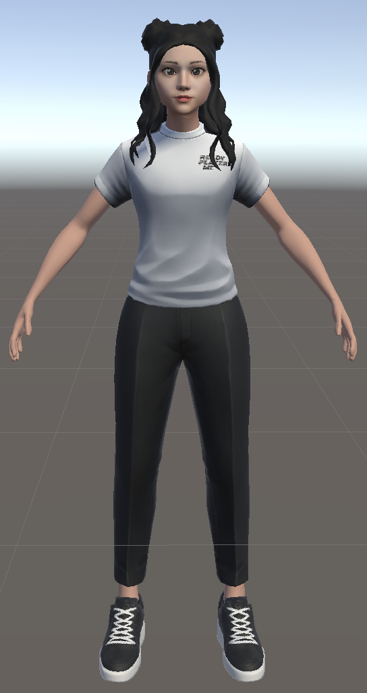
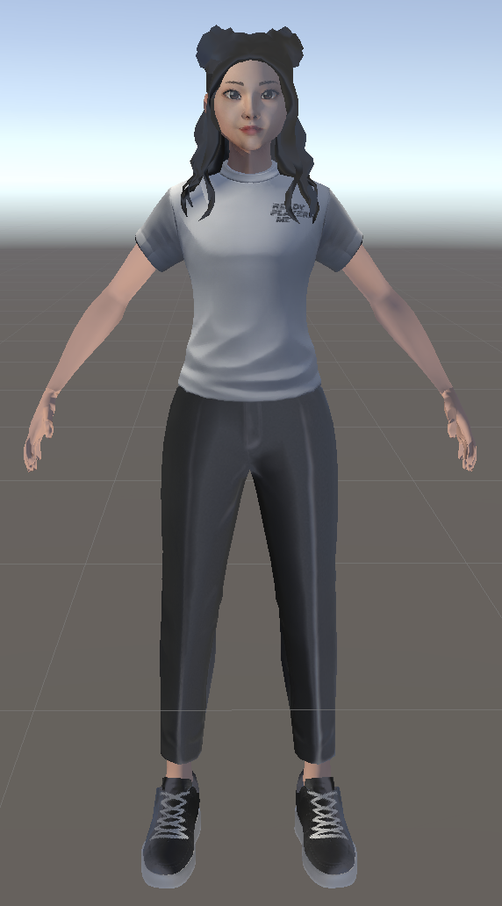

# Normal Maps Are Not Interpreted Correctly

## Description

If you've also encountered the same problem as me when using glTFast to import glb models:

1. When Platform is set to Windows/macOS/Linux, the model looks rendered normally.

2. When switching to Android, the model's surface light reflection looks strange, as shown in the image below.

    
    

    <em>Platform Set To PC</em> &nbsp;&nbsp;&nbsp;&nbsp;&nbsp;&nbsp;&nbsp;&nbsp;&nbsp;&nbsp;&nbsp;&nbsp;&nbsp;&nbsp;&nbsp;&nbsp;&nbsp; <em>Platform Set To Android</em>

You can try:

1. Open Project Settings -> Player -> Android Settings -> Other Settings

2. Change the "Normal Map Encoding" option to "XYZ"

## Reference 

https://github.com/atteneder/glTFast/issues/553