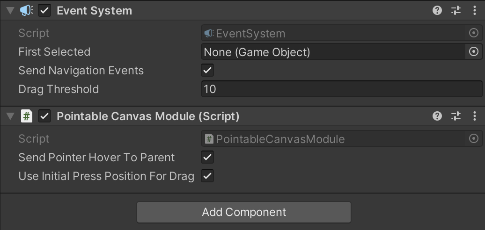

# Interact with Unity's UI component in 3D space

Update Date: 2023-12-15

## What is Event System

The `Event System` in Unity is a component that manages all event processing for the UI system. It is responsible for routing input events, such as mouse clicks, touches, and keyboard presses, to the appropriate UI elements.

The `Event System` is a singleton component, meaning that there can only be one instance of it in a scene. It is typically attached to a GameObject named "EventSystem" in the hierarchy.

## Why the Default Event System Falls Short in VR

The default Unity `Event System` assumes a 2D interaction model, which doesn't translate well to VR where users interact with the UI elements in a 3D space. For instance, the standard system doesn't account for depth or the spatial relation between the user and UI elements. It also doesn't support the input methods common in VR, such as gaze or hand tracking.

## Event System in 3D Space

The `PointableCanvasModule` from the Meta XR SDK extends Unity's PointerInputModule to handle VR-specific events like hovering, selecting, and dragging within 3D space. It translates VR interactions into pointer events that Unity's UI system can understand.

### Key Classes and Functions

- `PointableCanvasEventArgs`: A class that encapsulates event data for interactions with canvases, such as the canvas being interacted with, the GameObject hovered over, and whether the interaction involves dragging.

- `PointableCanvasModule`: The core class that manages all IPointerInteractableModule events and translates them into Unity Canvas UI pointer events.

- `Pointer`: An internal class that represents the state of an interactable element, storing information like its event data, position, and whether it's being pressed or dragged.

### Events

- `WhenSelected`: Triggered when an interactable element is selected.

- `WhenUnselected`: Triggered when an interactable element is unselected.

- `WhenSelectableHovered`: Triggered when an interactable element is hovered over.

- `WhenSelectableUnhovered`: Triggered when an interactable element is no longer hovered over.

### Public Methods

- `RegisterPointableCanvas`: Registers a canvas to the module so it can start receiving pointer events.
    
- `UnregisterPointableCanvas`: Unregisters a canvas from the module, ceasing the reception of pointer events.

### Private Methods

- `AddPointerCanvas`: Adds a canvas to the internal tracking system.

- `RemovePointerCanvas`: Removes a canvas from the internal tracking system.

- `HandlePointerEvent`: Handles incoming pointer events and updates the state of pointers accordingly.

- `Process`: Overrides PointerInputModule.Process to handle pointer processing each frame.

### Usage 

To use the `PointableCanvasModule` in your Unity project, simply search for the script in the Meta XR Interaction SDK, then attach it to the object where script `Event System` located.

## Reference

[Unity’s UI System in VR](https://developer.oculus.com/blog/unitys-ui-system-in-vr/)