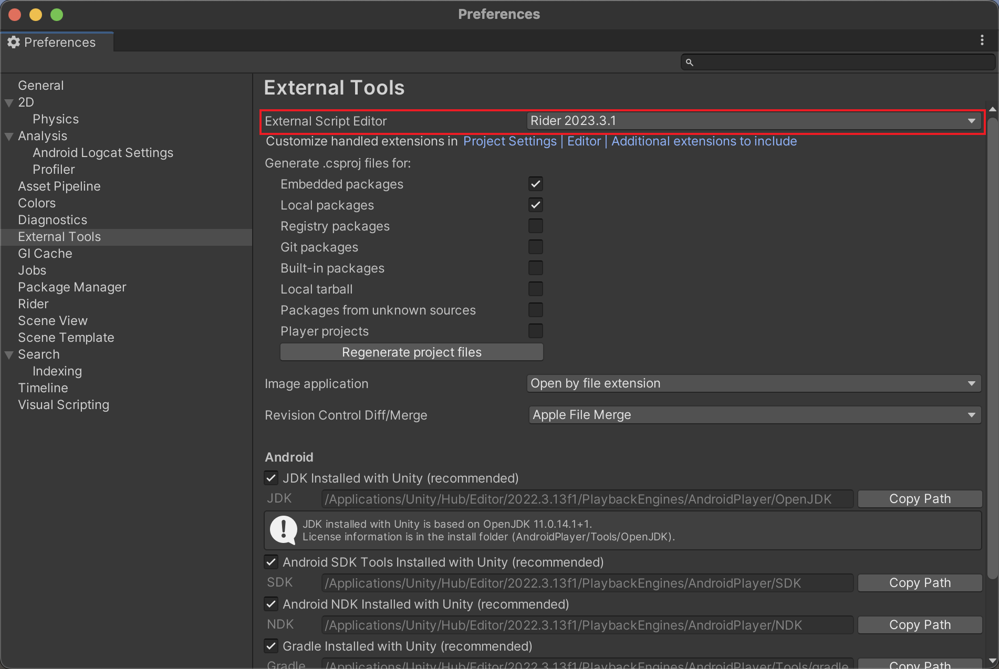
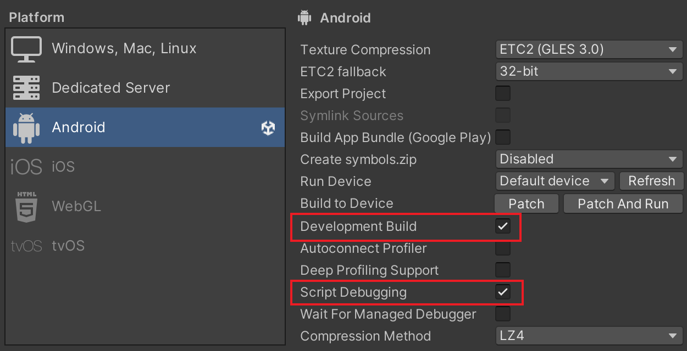
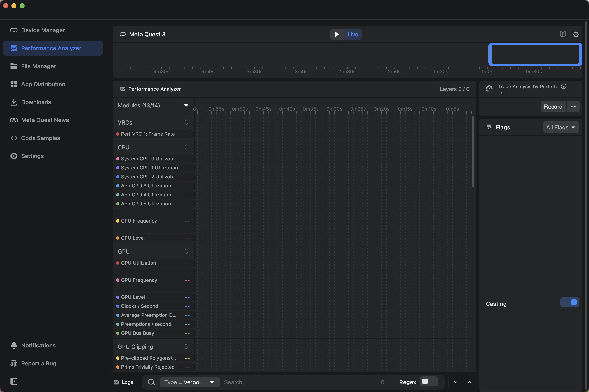

# Get Up to Speed with Your Development

Update Date: 2023-12-18

## Complete Basic Project Configuration

If this is your first time using Unity to develop an application for Meta Quest, I highly recommend starting with [this tutorial from Meta](https://developer.oculus.com/documentation/unity/unity-tutorial-hello-vr/), which shows how to create a basic Meta Quest application in Unity.

## Reference Documents and Projects

From my current experience, the [official documentation](https://developer.oculus.com/documentation/unity/) and [API reference](https://developer.oculus.com/reference/unity/v59/) both provide very detailed explanations, and I highly recommend starting from these two resources. The [StarterSamples](https://github.com/oculus-samples/Unity-StarterSamples) and [Meta XR Interaction SDK Samples](https://assetstore.unity.com/packages/tools/integration/meta-xr-interaction-sdk-ovr-samples-268521) projects offer very good and up-to-date use cases, which can help you quickly understand the composition and structure of applications. 

Of course, Meta also provides a wealth of examples, you can check them all from [here](https://github.com/oculus-samples).

## Debug Your Applications

### Use logs to debug your application

If you are accustomed to debugging your program by printing logs, then you can install Android Logcat in Unity Package Manager to view the log information during the program's execution.

You can also refer to my [case]() and create a new Debug interface in your application interface for your debugging. **I highly recommend this method**, as it allows you to debug your application more conveniently.

### Use breakpoints to debug your application

If you wish to use breakpoints to debug your application, then you need to:

- Step 1: Open Unity, go to Preferences -> External Tools -> Change your External Script Editor to Visual Studio or Rider.

- Step 2: Connect your Meta Quest and computer via a wired connection.

- Step 3: In the Build Settings, check Development Build and Script Debugging, then click Build and Run.

- Step 4: Switch to Visual Studio or Rider, select Attach to Unity Process, and then choose your Meta Quest from the list.

Then, you will be able to view the memory information at the breakpoints in the IDE.

### Use Meta Quest Developer Hub (MQDH) to debug your application

MQDH provides powerful performance analysis tools as well as log viewing tools; if you need to perform performance optimization for your application, then MQDH should be the best choice.

## Other Recommend Resources

[Dilmer Valecillos - YouTube](https://www.youtube.com/@dilmerv)